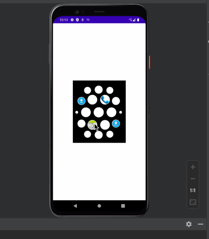

# MyApplication

The application which implements the apple watch view.

## Screenshots

## Thanks
- [BiitmapFun](https://github.com/kesenhoo/BitmapFun)

## Usage
First clone the projects and set your SDK path.

Then import the project into Android Studio: File -> Import Project -> Choose Directory -> Import from external model -> Gradle -> Use default gradle wrapper -> Finish